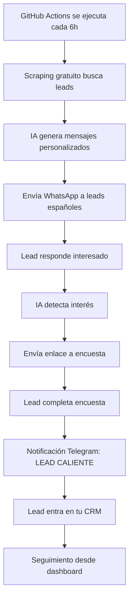

# 🚀 **CONFIGURACIÓN FINAL - SISTEMA DE LEADS DESARROYO TECH**

## ⚡ **¿QUÉ FALTA PARA ESTAR 100% OPERATIVO?**

Solo necesitas configurar **3 servicios externos** (todos gratuitos o muy baratos):

### **1. 🤖 API DE DEEPSEEK (IA) - $3-8/mes**
- **Para qué**: Generar mensajes personalizados con IA
- **Registro**: https://platform.deepseek.com/
- **Costo**: 10x más barato que OpenAI (~$3-8/mes)

**Pasos:**
1. Ve a https://platform.deepseek.com/
2. Regístrate con tu email
3. Ve a "API Keys" 
4. Crea una nueva API key
5. Copia el key que empieza con `sk-`

### **2. 📱 TWILIO WHATSAPP - ~$10-20/mes**
- **Para qué**: Enviar mensajes de WhatsApp automáticamente
- **Registro**: https://www.twilio.com/
- **Incluye**: $10 de crédito gratis

**Pasos:**
1. Ve a https://www.twilio.com/
2. Regístrate y verifica tu número
3. Ve a "Console" > "Settings" > "API keys & tokens"
4. Copia:
   - Account SID
   - Auth Token
5. Ve a "Messaging" > "WhatsApp sandbox" 
6. Copia tu número de WhatsApp sandbox

### **3. 📢 BOT DE TELEGRAM - GRATIS**
- **Para qué**: Recibir notificaciones de leads en tu móvil
- **Costo**: Completamente gratis

**Pasos:**
1. Abre Telegram
2. Busca "@BotFather"
3. Envía `/newbot`
4. Elige un nombre para tu bot (ej: "DesArroyo Leads Bot")
5. Copia el token que te da
6. Busca "@userinfobot" en Telegram
7. Envía `/start` y copia tu Chat ID

---

## 🔧 **CONFIGURACIÓN EN 5 MINUTOS**

### **Paso 1: Actualizar Variables de Entorno**

Edita el archivo `.env_leads_config` con los datos que obtuviste:

```env
# ===================================================
# CONFIGURACIÓN SISTEMA DE LEADS - DESARROYO TECH
# ===================================================

# 1. DEEPSEEK - IA PARA MENSAJES PERSONALIZADOS
DEEPSEEK_API_KEY=sk-tu_deepseek_key_aqui

# 2. TWILIO - WHATSAPP BUSINESS
TWILIO_ACCOUNT_SID=tu_account_sid_aqui
TWILIO_AUTH_TOKEN=tu_auth_token_aqui
TWILIO_WHATSAPP_NUMBER=+14155238886

# 3. TELEGRAM - NOTIFICACIONES
TELEGRAM_BOT_TOKEN=tu_bot_token_aqui
TELEGRAM_CHAT_ID=tu_chat_id_aqui

# 4. TU CONFIGURACIÓN
WEBSITE_URL=https://desarroyo.tech
BUSINESS_NAME=DesArroyo Tech
YOUR_NAME=Alberto

# 5. OBJETIVOS
TARGET_CITIES=Madrid,Barcelona,Valencia,Sevilla,Bilbao
TARGET_SECTORS=restaurantes,peluquerias,dentistas,abogados,hoteles,gimnasios
```

### **Paso 2: Configurar GitHub Secrets**

Ve a tu repositorio en GitHub > Settings > Secrets and variables > Actions

Añade estos secrets:

```
DEEPSEEK_API_KEY = tu_deepseek_key
TWILIO_ACCOUNT_SID = tu_account_sid
TWILIO_AUTH_TOKEN = tu_auth_token
TWILIO_WHATSAPP_NUMBER = tu_numero_whatsapp
TELEGRAM_BOT_TOKEN = tu_bot_token
TELEGRAM_CHAT_ID = tu_chat_id
WEBSITE_URL = https://desarroyo.tech
BUSINESS_NAME = DesArroyo Tech
YOUR_NAME = Alberto
```

### **Paso 3: Activar Automatización**

La automatización ya está configurada en `.github/workflows/generar_leads.yml` para ejecutarse:
- **Cada 6 horas automáticamente**
- **Manualmente cuando quieras**

---

## 🎯 **FLUJO COMPLETO QUE YA TIENES:**



---

## 🚀 **PRIMERA EJECUCIÓN (HOY MISMO)**

Una vez configurado, ejecuta manualmente:

### **Opción A: Desde GitHub Actions**
1. Ve a tu repo > Actions > "Sistema de Leads Automático"
2. Click "Run workflow"
3. Elige ciudad y sector
4. Click "Run workflow"

### **Opción B: Desde tu ordenador**
```bash
cd desarroyo-form
python3 scripts/sistema_leads_avanzado.py Madrid restaurantes
```

### **Opción C: Múltiples sectores**
```bash
# Restaurantes en Madrid
python3 scripts/sistema_leads_avanzado.py Madrid restaurantes

# Peluquerías en Barcelona  
python3 scripts/sistema_leads_avanzado.py Barcelona peluquerias

# Dentistas en Valencia
python3 scripts/sistema_leads_avanzado.py Valencia dentistas
```

---

## 📱 **LO QUE VERÁS EN FUNCIONAMIENTO:**

### **1. En Telegram (Notificaciones)**
```
🚀 LEADS CONTACTADOS - RESTAURANTES

📍 Ciudad: Madrid
🏢 Sector: restaurantes
📱 Contactados: 3
⭐ Score promedio: 78.5/100

📊 DETALLES:
1. 🇪🇸 Restaurante El Buen Sabor (85/100)
2. 🇪🇸 Pizzería La Italiana (80/100)
3. 🇪🇸 Tapas Casa Manolo (70/100)

💰 Costo estimado: $0.15-0.30
⏰ Próxima ejecución: En 6 horas
```

### **2. En WhatsApp (Mensajes enviados)**
```
¡Hola! Soy Alberto de DesArroyo Tech 👋

He visto Restaurante El Buen Sabor y me encanta el concepto. ¿Has pensado en tener una página web que muestre tu carta y permita reservas online?

Los restaurantes con web profesional consiguen 40% más reservas. ¿Te interesa saber más?
```

### **3. Cuando responden interesados**
```
¡Perfecto! 🎉 Para poder ofrecerte la mejor solución para tu negocio, necesito que completes esta breve encuesta:

🔗 https://desarroyo.tech/encuesta-evaluacion

Es súper rápida (2 minutos) y me ayudará a entender exactamente lo que necesitas. ¿Te parece bien?
```

### **4. Cuando completan encuesta**
```
🎉 ¡ENCUESTA COMPLETADA - LEAD CALIENTE!

📋 Negocio: Restaurante El Buen Sabor
📞 Teléfono: +34600123456
🏢 Sector: restaurantes
💰 Presupuesto: 500-1000€
⏰ Urgencia: En 1-2 semanas

🚀 ¡LEAD LISTO PARA VENTA!
💬 Confirmación enviada por WhatsApp
```

---

## 🎯 **TU CRM EN DESARROYO.TECH**

### **Dashboard Principal**
- URL: `https://desarroyo.tech/dashboard`
- Login: `admin` / `admin123`

**Funciones:**
✅ Ver todos los leads capturados  
✅ Estadísticas de conversión  
✅ Estado de automatizaciones  
✅ Gestión de clientes  
✅ Seguimiento de "leads calientes"  

### **Mini-CRM para Clientes**
Cada cliente que consigues tendrá su propio panel:
- URL: `https://desarroyo.tech/client-crm.html?client_id=123`
- Sus propios leads y estadísticas
- Control de automatizaciones

---

## 💰 **COSTOS MENSUALES ESTIMADOS:**

- **DeepSeek IA**: $3-8/mes
- **Twilio WhatsApp**: $10-20/mes
- **Telegram**: Gratis
- **Hosting**: Ya tienes en GitHub
- **Total**: **$13-28/mes** para un sistema que puede generar miles en ingresos

---

## 🚨 **IMPORTANTE: PRIMEROS PASOS**

1. **Configura las 3 APIs** (30 minutos máximo)
2. **Haz primera prueba manual** para verificar
3. **Activa automatización** cada 6 horas
4. **Prepara tu teléfono** para responder leads calientes
5. **Ten lista tu presentación** comercial

## 🎯 **EXPECTATIVAS REALISTAS:**

- **Leads contactados por día**: 5-15
- **Respuestas interesadas**: 1-3 por día
- **Encuestas completadas**: 0.5-2 por día
- **Conversiones a clientes**: 1-5 por semana

**Con solo 1 cliente/semana a 500€ = 2000€/mes de ingresos**

---

## ❓ **¿NECESITAS AYUDA?**

Si tienes problemas con alguna configuración, compárteme:
1. **Capturas de pantalla** de los errores
2. **Logs** de las ejecuciones
3. **API keys** (sin mostrar los valores reales)

¡Tu sistema está prácticamente listo para generar clientes automáticamente! 🚀 