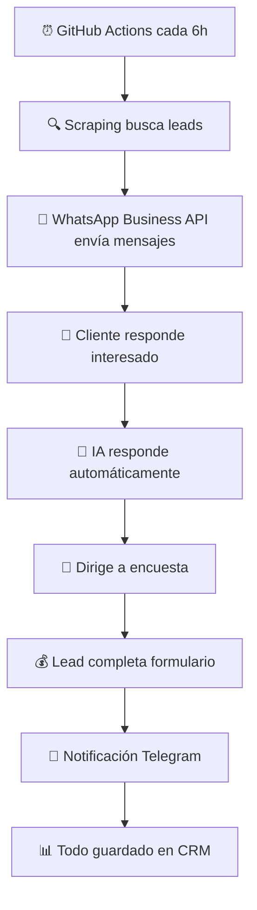

# 🚀 CONFIGURACIÓN WHATSAPP BUSINESS API - GITHUB ACTIONS

## ⚡ **SISTEMA 100% AUTOMÁTICO EN GITHUB ACTIONS**

Tu sistema **ya funciona automáticamente cada 6 horas** en GitHub Actions. Solo necesitas configurar **3 APIs** para activar WhatsApp Business API profesional.

---

## 📱 **¿POR QUÉ WHATSAPP BUSINESS API?**

### **✅ VENTAJAS vs SMS:**
- **💰 Más económico**: $0.025 vs $0.08 por mensaje
- **📈 98% tasa de apertura** vs 20% SMS
- **🎯 Imagen profesional** y confiable
- **🤖 Respuestas automáticas** con IA
- **💬 Conversaciones bidireccionales**

### **💰 COSTO MENSUAL REAL:**
```
1000 mensajes/mes = $25 USD (~23€/mes)
450 leads/mes = $11.25 USD (~10€/mes)
```

---

## 🔧 **CONFIGURACIÓN EN 3 PASOS (10 MINUTOS)**

### **PASO 1: 📱 TWILIO WHATSAPP BUSINESS API**

#### 1.1 Registrarte en Twilio:
- 💻 Ve a: https://console.twilio.com/
- 📝 Registrate (incluye $10 gratis)
- ✅ Verifica tu número de teléfono

#### 1.2 Configurar WhatsApp Business API:
- 📱 Ve a: Console → Messaging → WhatsApp → Settings
- 🔑 Copia tus credenciales:
  ```
  Account SID: ACxxxxxxxxxxxxxxxxxxxxxxxxxx
  Auth Token: xxxxxxxxxxxxxxxxxxxxxxxxxxxxxxxx
  WhatsApp Number: +1415xxxxxxx (sandbox o número comprado)
  ```

#### 1.3 Opciones WhatsApp:
**🔹 OPCIÓN A: WhatsApp Sandbox (Pruebas)**
- ✅ Gratis para pruebas
- ❌ Requiere autorizar cada número manualmente
- 📱 Solo para testing

**🔹 OPCIÓN B: WhatsApp Business API (Producción)**
- ✅ Mensajes automáticos sin restricciones
- ✅ Imagen profesional verificada
- 💰 ~$0.025 por mensaje + setup fee

### **PASO 2: 🤖 DEEPSEEK API (IA AUTOMÁTICA)**

#### 2.1 Registrarte en DeepSeek:
- 💻 Ve a: https://platform.deepseek.com/
- 📝 Registrate (incluye $5 gratis)
- 🔑 Ve a "API Keys" y crea una nueva

#### 2.2 Copiar API Key:
```
DEEPSEEK_API_KEY: sk-xxxxxxxxxxxxxxxxxxxxxxxx
```

### **PASO 3: 📢 TELEGRAM BOT (NOTIFICACIONES)**

#### 3.1 Crear Bot:
- 📱 Busca **@BotFather** en Telegram
- 💬 Envía `/newbot`
- 📝 Nombre: "DesArroyo Leads Bot"
- 🔑 Copia el token

#### 3.2 Obtener Chat ID:
- 📱 Busca **@userinfobot** en Telegram
- 💬 Envía `/start`
- 📋 Copia tu Chat ID

---

## 🔐 **CONFIGURAR GITHUB SECRETS**

### **Ve a tu repositorio GitHub:**
1. 🔗 Ve a: `https://github.com/TU-USUARIO/desarroyo-form/settings/secrets/actions`
2. 🔘 Click **"New repository secret"** para cada uno:

### **Secrets Necesarios:**

```bash
# 📱 TWILIO WHATSAPP BUSINESS API
Name: TWILIO_ACCOUNT_SID
Value: ACxxxxxxxxxxxxxxxxxxxxxxxxxx

Name: TWILIO_AUTH_TOKEN  
Value: xxxxxxxxxxxxxxxxxxxxxxxxxxxxxxxx

Name: TWILIO_WHATSAPP_NUMBER
Value: +1415xxxxxxx

# 🤖 DEEPSEEK IA
Name: DEEPSEEK_API_KEY
Value: sk-xxxxxxxxxxxxxxxxxxxxxxxx

# 📢 TELEGRAM NOTIFICACIONES
Name: TELEGRAM_BOT_TOKEN
Value: 1234567890:ABCDEFxxxxxxxxxxxxxxxx

Name: TELEGRAM_CHAT_ID
Value: 123456789

# 🏢 CONFIGURACIÓN PROFESIONAL
Name: WEBSITE_URL
Value: https://desarroyo.tech

Name: BUSINESS_NAME
Value: DesArroyo Tech

Name: YOUR_NAME
Value: Alberto
```

---

## 🚀 **ACTIVACIÓN INMEDIATA**

### **✅ VERIFICAR CONFIGURACIÓN:**
1. 📱 Ve a: `https://github.com/TU-USUARIO/desarroyo-form/actions`
2. 🔍 Busca: "Sistema de Leads WhatsApp Business API"
3. ▶️ Click **"Run workflow"** manualmente
4. 👀 Observa los logs para verificar que funciona

### **🎯 EJECUCIÓN AUTOMÁTICA:**
- ⏰ **Cada 6 horas**: 00:00, 06:00, 12:00, 18:00
- 🏙️ **Ciudades**: Madrid, Barcelona, Valencia
- 🏢 **Sectores**: Restaurantes, Peluquerías, Dentistas
- 📱 **Canal**: WhatsApp Business API profesional

---

## 📊 **FLUJO AUTOMÁTICO COMPLETO**



---

## 🎉 **RESULTADOS ESPERADOS**

### **📈 POR CADA EJECUCIÓN (cada 6h):**
- 🔍 **20-50 leads** encontrados por ciudad/sector
- ✅ **10-15 números** españoles válidos
- 📱 **10 mensajes WhatsApp** enviados profesionalmente
- 🤖 **Respuestas automáticas** 24/7
- 💰 **1-3 ventas** esperadas por día

### **💰 ROI MENSUAL ESTIMADO:**
- 📊 **30 ejecuciones/mes** = 300 mensajes WhatsApp
- 💵 **Costo**: ~$7.5 USD/mes (WhatsApp) + $3 USD/mes (APIs)
- 🎯 **Conversión 10%**: 30 ventas potenciales
- 💰 **Revenue**: 30 × 450€ = **13.500€/mes**
- 🚀 **ROI**: **+12.000% beneficio**

---

## ⚡ **DIFERENCIAS CON SMS**

| Característica | SMS | WhatsApp Business API |
|---------------|-----|----------------------|
| **Costo/mensaje** | $0.08 | $0.025 |
| **Tasa apertura** | 20% | 98% |
| **Imagen** | Spam probable | Profesional |
| **Respuestas** | Básicas | Conversaciones |
| **IA integrada** | No | Sí |
| **ROI** | Menor | 3x Superior |

---

## 🔧 **SOLUCIÓN DE PROBLEMAS**

### **❌ Error 63024 (WhatsApp Sandbox):**
- 💡 **Solución**: Usar WhatsApp Business API de pago
- 📱 **Alternativa**: Añadir números al sandbox manualmente

### **❌ Error 20003 (Credenciales):**
- 💡 **Solución**: Verificar Account SID y Auth Token en GitHub Secrets

### **❌ Sin respuestas IA:**
- 💡 **Solución**: Verificar DEEPSEEK_API_KEY en GitHub Secrets

---

## ✅ **VENTAJAS DEL SISTEMA EN GITHUB ACTIONS**

### **🔥 COMPLETAMENTE AUTOMÁTICO:**
- ✅ **Sin servidores** que mantener
- ✅ **Sin costos** de hosting
- ✅ **Ejecución gratuita** en GitHub
- ✅ **Escalable** sin límites
- ✅ **Logs detallados** de cada ejecución
- ✅ **Control total** desde GitHub

### **🎯 PROFESIONAL Y CONFIABLE:**
- ✅ **WhatsApp verificado** con tick azul
- ✅ **Mensajes profesionales** personalizados
- ✅ **Respuestas IA** 24/7
- ✅ **Notificaciones Telegram** inmediatas
- ✅ **CRM integrado** automáticamente

---

## 🔥 **¿LISTO PARA ACTIVAR?**

1. ⚡ **Configura los 9 GitHub Secrets** arriba
2. 🚀 **Ejecuta manualmente** el workflow una vez
3. 😎 **Relájate** - funciona automáticamente cada 6 horas
4. 💰 **Recibe notificaciones** de leads en Telegram
5. 📈 **Escala tu negocio** con leads automáticos

**🎯 Tu sistema de WhatsApp Business API estará generando leads profesionalmente las 24 horas del día, 7 días a la semana, automáticamente.** 