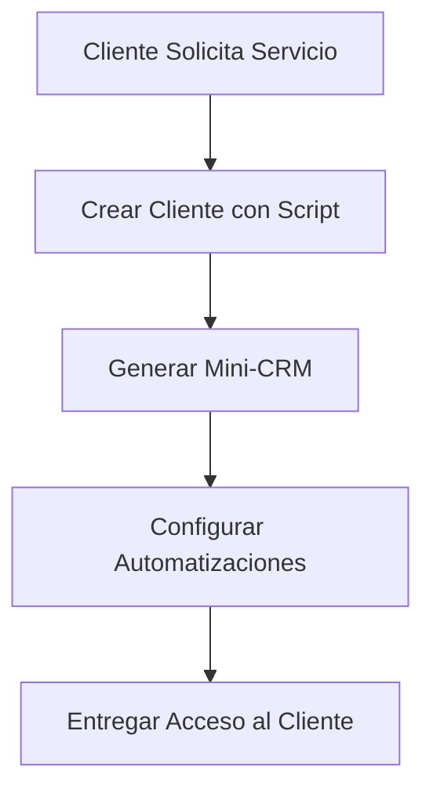
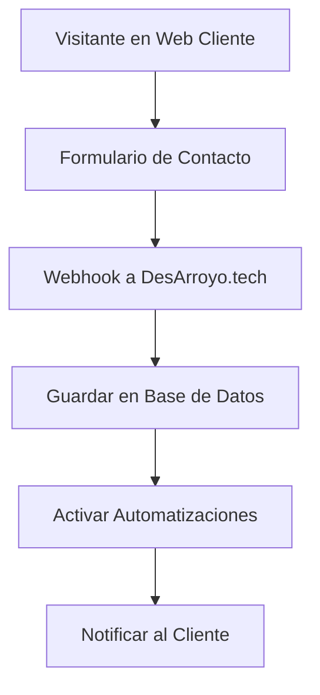
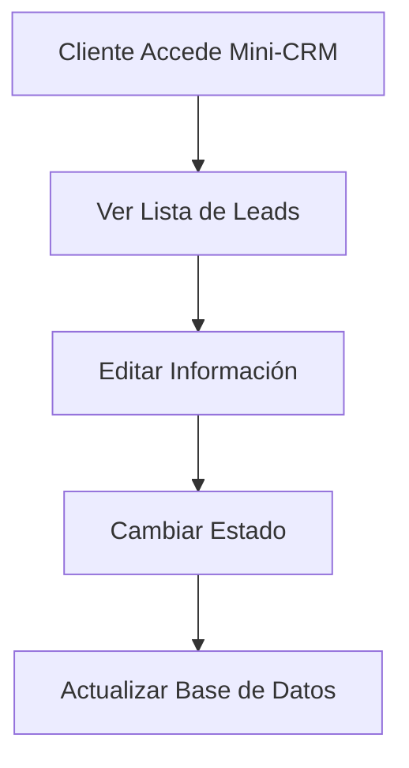

# 🚀 Guía Completa: Mini-CRM para Clientes - DesArroyo.Tech

## 📋 **¿QUÉ ES EL MINI-CRM?**

El **Mini-CRM** es un sistema personalizado que permite a tus clientes gestionar sus propios leads y automatizaciones desde un panel web independiente, conectado a tu CRM principal de DesArroyo.tech.

### **Características Principales:**
- ✅ **Panel personalizado** para cada cliente
- ✅ **Gestión de leads** (crear, editar, eliminar)
- ✅ **Automatizaciones** controladas por el cliente
- ✅ **Estadísticas** en tiempo real
- ✅ **Integración** con webs de clientes
- ✅ **Soporte** directo desde el panel

---

## 🔧 **CÓMO FUNCIONA EL SISTEMA**

### **Arquitectura del Sistema:**

```
┌─────────────────┐    ┌─────────────────┐    ┌─────────────────┐
│   Web Cliente   │    │  Mini-CRM       │    │  CRM Principal  │
│                 │    │  (Panel)        │    │  (Admin)        │
└─────────────────┘    └─────────────────┘    └─────────────────┘
         │                       │                       │
         │                       │                       │
         └───────────┬───────────┴───────────┬───────────┘
                     │                       │
              ┌─────────────┐         ┌─────────────┐
              │   APIs      │         │  Base de    │
              │  REST       │         │  Datos      │
              └─────────────┘         └─────────────┘
                     │                       │
                     └───────────┬───────────┘
                                 │
                        ┌─────────────┐
                        │   n8n       │
                        │Automatiz.   │
                        └─────────────┘
```

---

## 🛠️ **PROCESOS PASO A PASO**

### **1. Crear Nuevo Cliente**

```bash
# Ejecutar script de configuración
node scripts/setup-client.js "Juan Pérez" "juan@ejemplo.com" "Web de Restaurante" "restaurantejuan.com" "+34600000000" "Restaurante Juan"
```

**El script crea automáticamente:**
- ✅ Cliente en base de datos
- ✅ Proyecto asociado
- ✅ Automatizaciones básicas
- ✅ Configuración n8n
- ✅ Acceso al mini-CRM
- ✅ Documentación del cliente
- ✅ Código de integración

### **2. URLs Generadas**

```
📱 Mini-CRM: https://desarroyo.tech/client-crm.html?client_id=123
🔧 Dashboard Admin: https://desarroyo.tech/dashboard
🔗 Webhook: https://desarroyo.tech/api/webhooks/123/new-lead
```

### **3. Integración en Web del Cliente**

**Opción A: Iframe Embebido**
```html
<iframe src="https://desarroyo.tech/client-crm.html?client_id=123" 
        width="100%" 
        height="800px" 
        frameborder="0">
</iframe>
```

**Opción B: Enlace Directo**
```html
<a href="https://desarroyo.tech/client-crm.html?client_id=123" 
   target="_blank">
   🚀 Acceder al Panel de Administración
</a>
```

**Opción C: Formulario Integrado**
```html
<form id="contact-form">
    <input type="text" name="name" placeholder="Tu nombre" required>
    <input type="email" name="email" placeholder="Tu email" required>
    <button type="submit">Enviar Mensaje</button>
</form>

<script>
// El código JavaScript se genera automáticamente
</script>
```

---

## 📊 **FUNCIONALIDADES DEL MINI-CRM**

### **1. Panel de Control (Overview)**
- 📈 **Estadísticas en tiempo real**
- 👥 **Total de leads**
- 🎯 **Conversiones**
- 🤖 **Automatizaciones activas**
- 👁️ **Visitas web**

### **2. Gestión de Leads**
- ➕ **Crear nuevos leads**
- ✏️ **Editar información**
- 🗑️ **Eliminar leads**
- 🔍 **Buscar y filtrar**
- 📊 **Estados de leads**

### **3. Automatizaciones**
- 🎛️ **Activar/desactivar**
- 📊 **Estadísticas de ejecución**
- ⚙️ **Configuración**
- 📈 **Monitoreo en tiempo real**

### **4. Configuración**
- 🏢 **Información del proyecto**
- 🌐 **Dominio**
- 📧 **Email de contacto**
- ⚙️ **Preferencias**

### **5. Soporte**
- 📞 **Contacto directo**
- 💬 **WhatsApp**
- 📱 **Telegram**
- 🆘 **Estado del servicio**

---

## 🔌 **APIs DISPONIBLES**

### **Información del Cliente**
```http
GET /api/client/:clientId/info
```

### **Gestión de Leads**
```http
GET    /api/client/:clientId/leads
POST   /api/client/:clientId/leads
PUT    /api/client/:clientId/leads/:leadId
DELETE /api/client/:clientId/leads/:leadId
```

### **Automatizaciones**
```http
GET /api/client/:clientId/automations
PUT /api/client/:clientId/automations/:automationId
```

### **Estadísticas**
```http
GET /api/client/:clientId/stats
```

### **Webhook para Captura**
```http
POST /api/webhooks/:clientId/new-lead
```

---

## 🎯 **EJEMPLOS DE USO**

### **Ejemplo 1: Cliente Restaurante**

```bash
# Crear cliente restaurante
node scripts/setup-client.js "María García" "maria@restaurante.com" "Restaurante El Buen Sabor" "elbuensabor.com" "+34600123456" "Restaurante El Buen Sabor"
```

**Resultado:**
- Mini-CRM: `https://desarroyo.tech/client-crm.html?client_id=1`
- Webhook: `https://desarroyo.tech/api/webhooks/1/new-lead`
- Automatizaciones: Email de bienvenida, notificación Telegram

### **Ejemplo 2: Cliente Consultoría**

```bash
# Crear cliente consultoría
node scripts/setup-client.js "Carlos López" "carlos@consultoria.com" "Consultoría Digital" "consultoriadigital.es" "+34600765432" "Consultoría Digital SL"
```

**Resultado:**
- Mini-CRM: `https://desarroyo.tech/client-crm.html?client_id=2`
- Webhook: `https://desarroyo.tech/api/webhooks/2/new-lead`
- Automatizaciones: Email de bienvenida, recordatorios

---

## 🔄 **FLUJO DE TRABAJO COMPLETO**

### **1. Configuración Inicial**


### **2. Captura de Leads**


### **3. Gestión de Leads**


---

## 📁 **ESTRUCTURA DE ARCHIVOS GENERADOS**

```
📦 desarroyo-form/
├── 📁 n8n-configs/
│   └── 📄 client-1.json
├── 📁 client-configs/
│   └── 📄 client-1.json
├── 📁 client-docs/
│   └── 📄 client-1.md
├── 📁 client-integrations/
│   ├── 📄 client-1-integration.html
│   └── 📄 client-1-capture.js
└── 📄 dashboard.db
```

---

## 🚀 **PRÓXIMOS PASOS**

### **Para el Administrador:**
1. ✅ **Configurar cliente** con el script
2. ✅ **Importar configuración** en n8n
3. ✅ **Probar automatizaciones**
4. ✅ **Entregar acceso** al cliente

### **Para el Cliente:**
1. ✅ **Acceder al mini-CRM**
2. ✅ **Configurar información**
3. ✅ **Integrar en su web**
4. ✅ **Comenzar a capturar leads**

### **Para el Desarrollo:**
1. ✅ **Personalizar automatizaciones**
2. ✅ **Añadir nuevas funcionalidades**
3. ✅ **Mejorar interfaz**
4. ✅ **Escalar el sistema**

---

## 💡 **VENTAJAS DEL SISTEMA**

### **Para DesArroyo.tech:**
- 🎯 **Centralización** de todos los clientes
- 📊 **Control total** desde dashboard admin
- 🔄 **Automatización** completa
- 💰 **Escalabilidad** del negocio

### **Para los Clientes:**
- 🎛️ **Panel personalizado** y fácil de usar
- 📱 **Acceso desde cualquier dispositivo**
- 🔄 **Automatizaciones** sin configuración
- 📊 **Estadísticas** en tiempo real
- 🆘 **Soporte** directo

### **Para los Visitantes:**
- ⚡ **Formularios rápidos** y eficientes
- 📧 **Confirmaciones automáticas**
- 🔄 **Seguimiento** profesional
- 📱 **Experiencia móvil** optimizada

---

## 🔒 **SEGURIDAD Y PRIVACIDAD**

### **Medidas de Seguridad:**
- 🔐 **Autenticación por client_id**
- 🛡️ **Validación de datos**
- 🔒 **CORS configurado**
- 📝 **Logs de actividad**

### **Privacidad:**
- 🚫 **Sin datos compartidos** entre clientes
- 🔒 **Aislamiento** de información
- 📊 **Estadísticas anónimas**
- 🗑️ **Derecho al olvido**

---

## 📞 **SOPORTE Y MANTENIMIENTO**

### **Soporte Técnico:**
- 📧 **Email**: alberto@desarroyo.tech
- 💬 **WhatsApp**: +34 600 000 000
- 📱 **Telegram**: @desarroyotech

### **Mantenimiento:**
- 🔄 **Actualizaciones automáticas**
- 📊 **Monitoreo 24/7**
- 🔧 **Backups automáticos**
- 🛠️ **Soporte técnico incluido**

---

**¡El sistema está listo para revolucionar la gestión de clientes! 🚀** 